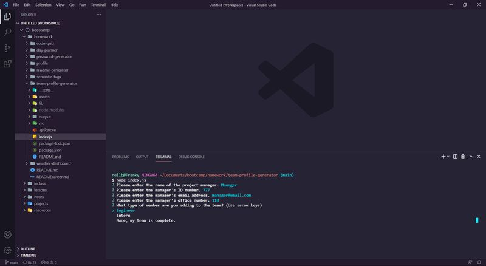
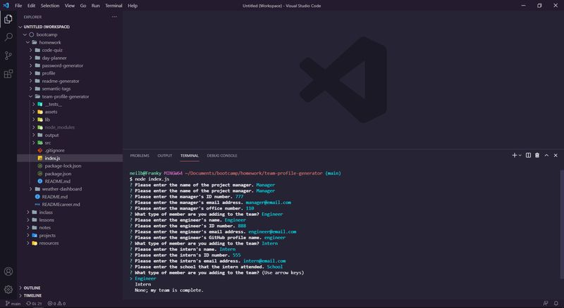
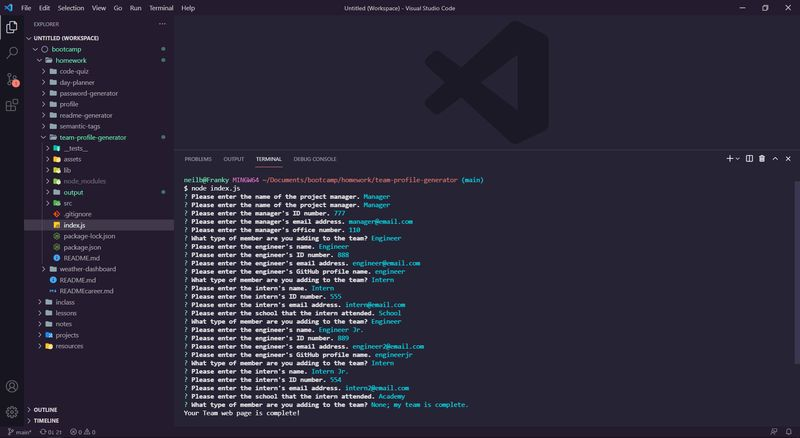

# Team Profile Generator  

## Description  

This Node.js app allows the user to generate a team profile web page by answering command line questions in the terminal using the Inquirer package.  

## Table of Contents
- ### [Installation](#installation)
- ### [Usage](#usage)
- ### [Screenshots](#screenshots)
- ### [Contributing](#contributing)
- ### [Tests](#tests)
  

## Installation  

Simply install Node.js, open the terminal, run 'npm install' and then index.js from the directory command line.  

## Usage  

Once the application is called by typing "node index.js" in the terminal, the user just types the answers to the questions on the command line as they appear. Once finished, the team profile HTML file is produced.  

Check out this [demo video](https://drive.google.com/file/d/1ywWZ3ABokFlOLtnPXkb0o5XgUIBq1CWq/view) to see it in action.  

## Screenshots  
  

---  

  

---  

  

## Contributing  

Neil Burt  

## Tests  

Test files for all classes used in the app are included in this repo in the test folder.  

## Questions  

If you have any additional questions:  

Visit my [GitHub profile](https://github.com/neilburt).  

Or you can [email me](mailto:neil.burt@comcast.net).